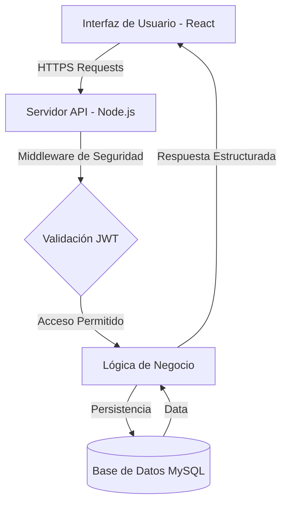

# Sistema Integral de Gestión Minimarket

## Descripción General

El Sistema de Gestión Minimarket es una plataforma empresarial diseñada para la optimización de procesos operativos en establecimientos minoristas. Desarrollada bajo estándares de ingeniería de software por estudiantes de la Universidad Tecnológica del Perú, la aplicación garantiza una gestión eficiente de inventarios, ventas y seguridad de la información.

## Especificaciones Técnicas

### Arquitectura y Stack

La solución se basa en una arquitectura de desacoplamiento entre cliente y servidor, asegurando escalabilidad y mantenimiento modular.

* **Frontend**: React 19, Vite, Tailwind CSS.
* **Backend**: Node.js, Express.
* **Base de Datos**: MySQL.
* **Seguridad**: Autenticación basada en JSON Web Tokens y encriptación Bcrypt.

## Funcionalidades Core

1. **Seguridad y Acceso**: Sistema de autenticación con control de sesión persistente.
2. **Control de Acceso Basado en Roles**: Diferenciación de privilegios para perfiles de Administrador, Supervisor y Cajero.
3. **Gestión de Inventarios**: Módulo completo para el control de stock, categorías y proveedores.
4. **Procesamiento de Ventas**: Interfaz transaccional para el registro de movimientos comerciales en tiempo real.
5. **Análisis de Datos**: Dashboard de métricas operativas para la supervisión gerencial.

## Diagrama de Arquitectura

## Guía de Implementación

### Requisitos del Sistema

* Node.js v18.0 o superior
* Entorno de ejecución MySQL
* Gestor de paquetes NPM

### Configuración del Entorno

1. **Clonación**: Descargar el código fuente desde el repositorio institucional.
2. **Persistencia**: Ejecutar el script SQL ubicado en `/database/script.sql`.
3. **Variables de Entorno**: Configurar el archivo `.env` en la raíz del Backend con los parámetros de conexión correspondientes (DB_HOST, DB_USER, DB_PASSWORD, JWT_SECRET).

### Despliegue en Desarrollo

* **Backend**: `cd Backend && npm install && npm start`
* **Frontend**: `cd frontend && npm install && npm run dev`

## Equipo de Desarrollo

| Nombre | Rol | Responsabilidades |
| :--- | :--- | :--- |
| **Fabian Eduardo Guevara Perez** | Líder de Proyecto | Dirección técnica y gestión de requerimientos. |
| **Dennys Ricardo Lozano Castro** | Backend Developer | Diseño de API y arquitectura de datos. |
| **Juan José Alonso** | Frontend Developer | Implementación de interfaz y lógica de cliente. |

## Licencia

Este software ha sido desarrollado con fines académicos para la facultad de Ingeniería de Sistemas de la UTP.
